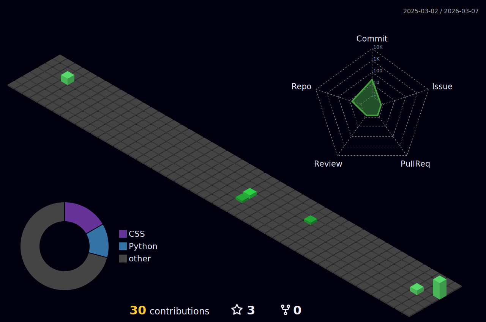

## Hi there 👋

- 👋 Hi, I'm **Nozimjon Hamdamov** (**n1kodev**). Graduated from **Amity University in Tashkent**.
- 🧑‍💻 A Backend Developer and AI Engineer living in Tashkent, Uzbekistan. Working at **Jett** as an **AI Engineer**.
- 🔭 I'm currently focused on **Backend Development**, **Artificial Intelligence** and **Machine Learning**.
- 🌱 I'm currently learning new AI/ML frameworks and improving my backend architecture skills.
- 🤝 I am open to collaboration on interesting backend and AI projects.
- 📬 How to reach me: [nozimjon_hamdamov](https://t.me/nozimjon_hamdamov) on Telegram or [LinkedIn](https://www.linkedin.com/in/nozimjon-hamdamov-3a03b7224/)
- 🐦 Follow me on [X (@nozim_hamdamov)](https://x.com/nozim_hamdamov) and [Instagram (nozimjon_hamdamov)](https://instagram.com/nozimjon_hamdamov)
- 💼 Recently, I have been looking for jobs related to Backend and AI. If there is a suitable job opportunity, please feel free to reach out via Telegram. I will respond at the earliest convenience after receiving your message

## Technologies 💻

  
  
  
  
  
  
  
  
  

  
  
  
  
  
  
  
  
  

  
  
  
  
  
  

## Profile Views

counting of visitors to this page in this section started from March 03, 2026

<table>
  <tr>
    <td>
      
    </td>
    <td>
      
    </td>
  </tr>
</table>

<picture>
  <source media="(prefers-color-scheme: dark)" srcset="./profile-3d-contrib/profile-night-green.svg" />
  <source media="(prefers-color-scheme: light)" srcset="./profile-3d-contrib/profile-green.svg" />
  
</picture>

